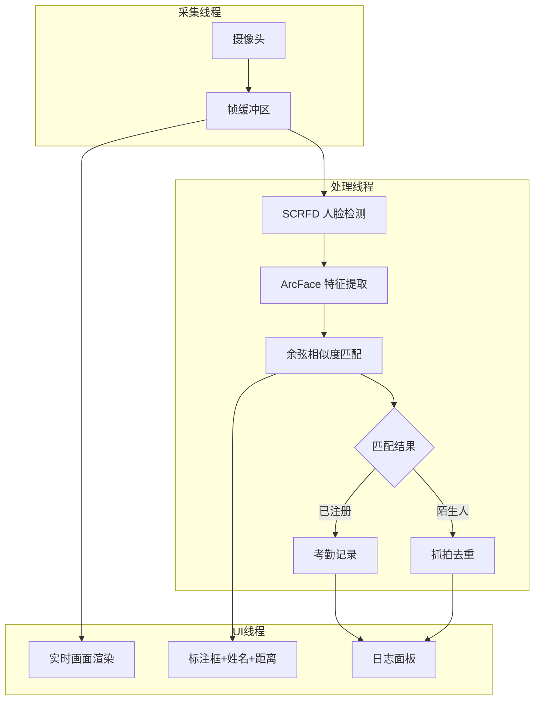
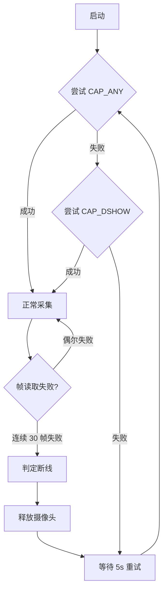

# face-system 架构设计

摄像头采集 → SCRFD 人脸检测 → ArcFace 特征提取 → 余弦相似度匹配 → 考勤记录。

本仓库公开项目的**架构设计、GPU 推理工程和容错机制**，不包含可运行源码。

---

## 系统架构

## 核心设计决策

### 1. 三线程架构（采集 / 处理 / UI 分离）

**问题**：单线程下，摄像头读取（~33ms/帧@30FPS）+ 模型推理（~20ms）+ UI 渲染（~16ms）串行执行，总延迟 >70ms，画面卡顿明显。

**方案**：

| 线程 | 职责 | 帧率 | 阻塞风险 |
|------|------|------|---------|
| 采集线程 | 摄像头读取 → 写入帧缓冲 | 30FPS | 摄像头断线 |
| 处理线程 | 检测 → 特征 → 匹配 | ~25FPS | GPU 推理超时 |
| UI 线程 | 渲染画面 + 标注 + 日志 | 30FPS | Tkinter 主循环阻塞 |

**线程间通信**：
- 采集 → 处理：单帧缓冲区（最新帧覆盖旧帧，不排队）。处理线程永远拿最新帧，避免延迟累积。
- 处理 → UI：结果队列（标注坐标、姓名、距离、事件）。UI 线程每帧消费队列。
- 采集 → UI：直接共享帧引用（只读），UI 线程渲染时不加锁（允许偶尔撕裂，换取流畅度）。

**取舍**：不用多帧队列。排队会导致"处理的是 3 秒前的帧"，实时性比完整性重要。

### 2. SCRFD + ArcFace 两阶段流水线

**为什么不用单模型（如 FaceNet）**：
- SCRFD 专做检测（定位人脸框），ArcFace 专做识别（提取 512 维特征向量）
- 两阶段解耦：检测失败不影响已注册库，识别失败不影响画面渲染
- ONNX Runtime GPU 推理，两个模型共享同一个 CUDA ExecutionProvider

**推理参数**：

| 模型 | 输入尺寸 | 输出 | 阈值 |
|------|---------|------|------|
| SCRFD (det_10g.onnx) | 240×240 | 人脸框 + 5 关键点 | det_thresh=0.65, nms_thresh=0.4 |
| ArcFace (w600k_r50.onnx) | 112×112（对齐后） | 512 维特征向量 | cosine_sim ≥ 0.45 |

**对齐流程**：SCRFD 输出 5 个关键点（双眼、鼻尖、嘴角×2）→ 仿射变换对齐到 112×112 → 送入 ArcFace。

**阈值选择 0.45 的原因**：
- 0.35 偏松：长相相似的人（如兄弟）容易误识别
- 0.55 偏严：同一人不同光照/角度会拒绝
- 0.45 是精度和召回的平衡点（实测 20 人注册库，误识率 <2%，拒识率 <5%）

### 3. 摄像头容错机制

**问题**：USB 摄像头不稳定——断线、被其他程序占用、驱动崩溃、热插拔。

**容错策略**：

**关键设计**：
- 启动回退：`CAP_ANY` → `CAP_DSHOW`（Windows 下 DirectShow 兼容性更好）
- 热插拔检测：每 5s 检查 `cap.isOpened()`，断开后自动重连
- 不弹错误对话框：所有异常写日志 + UI 状态栏提示，不打断用户

### 4. 陌生人抓拍去重

**问题**：未注册的人出现在画面中，每帧都触发抓拍 → 1 秒 30 张重复照片。

**方案**：冷却时间机制（`CAPTURE_COOLDOWN_SECONDS = 5`）。

- 首次检测到陌生人脸 → 立即抓拍 + 记录时间戳
- 5 秒内同一位置（IoU > 0.5）的陌生人脸 → 跳过
- 5 秒后仍检测到 → 再次抓拍（可能是不同人）

**取舍**：不做陌生人人脸识别聚类（无监督），只用位置 + 时间去重。简单够用。

### 5. 隐私与数据安全

**设计原则**：个人生物特征数据绝不入 Git。

| 数据类型 | 存储位置 | .gitignore |
|---------|---------|-----------|
| 注册人脸照片 | `registered_faces/` | ✅ 排除 |
| 陌生人抓拍 | `captured_faces/` | ✅ 排除 |
| 考勤日志 | `attendance_log/` | ✅ 排除 |
| ONNX 模型文件 | `models/` | ✅ 排除 |
| 配置文件（阈值/路径） | `config.py` | ❌ 入库（无敏感信息） |

**模型文件获取**：README 注明下载地址（InsightFace 官方 release），不随仓库分发。

---

## 性能实测

| 指标 | 数值 | 测试条件 |
|------|------|---------|
| 推理帧率 | ~30 FPS | GPU, 单人画面, 240×240 检测 |
| 推理帧率 | ~18 FPS | GPU, 5人同框, 240×240 检测 |
| 端到端延迟 | <80ms | 采集→检测→识别→UI渲染 |
| 注册库容量 | 20人 | 未测试更大规模 |
| 内存占用 | ~1.2GB | 含两个 ONNX 模型 + OpenCV 缓冲 |

---

## 已知限制

- 仅支持 Windows（Tkinter + DirectShow + CUDA 路径硬编码）
- 注册库为文件目录遍历，无数据库索引，>100 人时匹配变慢
- 活体检测为轻量级方案，非深度学习对抗级别
- PyInstaller 打包后模型路径需要 `_internal/` 前缀适配
